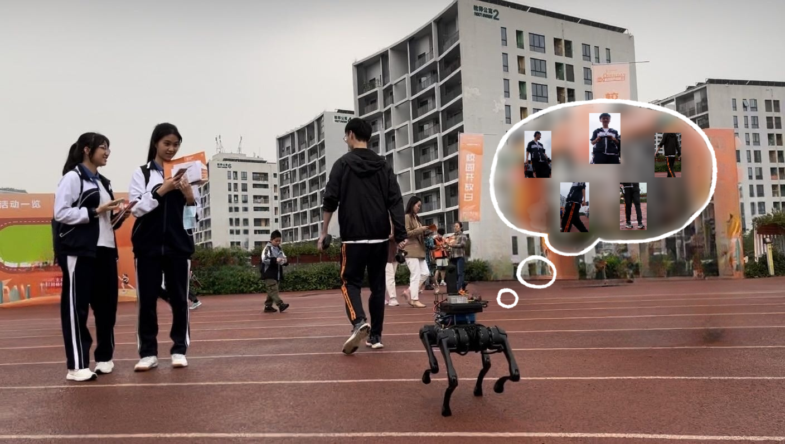

# OCL-RPF

> <b>Person Re-Identification for Robot Person Following with Online Continual Learning</b> <br>
> Hanjing Ye, Jieting Zhao, Yu Zhan, Weinan Chen, Li He and Hong Zhang <br>
> 2024 IEEE Robotics and Automation Letters (RAL)<br>
> [<u>site</u>](https://sites.google.com/view/oclrpf), [<u>paper</u>](http://medlartea.github.io/files/ocl_rpf.pdf), [<u>video</u>](https://www.youtube.com/watch?v=DF9o8SY15S4&ab_channel=TeaMedlar)

<p align="center">

</p>

## TODO

- [x] Release codes of part-based OCLReID, global-based OCLReID and part-based OCL-RPF with Reservoir-based memory manager
- [ ] Release other replay-based memory managers
- [ ] Update code with multi-threads
- [ ] Optimize code running efficiency

## Install

### For Video Running Only

Create a conda environment and install OCLReID (based on mmtrack), worked in RTX3090
```bash
git clone https://github.com/MedlarTea/OCLReID
cd OCLReID
conda create -n oclreid python=3.7
conda activate oclreid
conda install pytorch=1.11 cudatoolkit=11.3 torchvision=0.12.0 -c pytorch
pip install mmcv-full==1.5.3 -f https://download.openmmlab.com/mmcv/dist/cu113/torch1.11.0/index.html
pip install mmdet==2.26.0
pip install -r requirements.txt
pip install -r requirements/build.txt
pip install -v -e .

# install orientation estimation method
cd mmtrack/models/orientation
pip install -r requirements.txt
pip install -v -e .
```

Download pre-trained weights for OCLReID
  - Download 2d joint detection models: [Google drive](https://drive.google.com/drive/folders/1v-2Noym5U13BG6Zwj9EoqYRn6GXimh6p?usp=sharing) and put the checkpoints to `OCLReID/mmtrack/models/pose/Models/sppe`.
  - Download ReID models: [Google drive](https://drive.google.com/file/d/1cjqnHFcYzFZvzLrqvzry6Bgt8mWaWILg/view?usp=drive_link), then make directory `OCLReID/checkpoints/reid` and put the checkpoints to it.

### For Robot/Rosbag Running (optionally)
For running a complete RPF system, besides the above installation, some packages need to be installed:
- ROS, verified in melodic and noetic
- OpenCV == 3.4.12 (tested)
- Eigen == 3.4.0 (tested)
- Ceres == 2.1.0 (tested)

Download pre-trained weights for OCL-RPF:
- Download bounding-box detection models: [yolox-s](https://megvii-my.sharepoint.cn/:u:/g/personal/gezheng_megvii_com/EW62gmO2vnNNs5npxjzunVwB9p307qqygaCkXdTO88BLUg?e=NMTQYw) and [yolox-m](https://megvii-my.sharepoint.cn/:u:/g/personal/gezheng_megvii_com/ERMTP7VFqrVBrXKMU7Vl4TcBQs0SUeCT7kvc-JdIbej4tQ?e=1MDo9y), then make directory `mono_tracking/scripts/AlphaPose/YOLOX/weights` and put the checkpoints to it.
- Put the 2d joint detection checkpoints to `mono_tracking/scripts/AlphaPose/Models/sppe`.


Create and build ROS workspace:
```bash
mkdir oclrpf_ws && cd oclrpf_ws
git clone https://github.com/MedlarTea/OCL-RPF src
rosdep install --from-paths src --ignore-src -r -y
catkin_make -DPYTHON_EXECUTABLE=/usr/bin/python3
```

## Run It!

### Video Running
```bash
cd OCLReID
python run_video.py --show_result
```
This would run the `./demo.mp4`.

### Rosbag Running
```bash
cd oclrpf_ws
source devel/setup.bash # or devel/setup.zsh
roslaunch mono_tracking all_mono_tracking.launch sim:=false oclreid_dir:="$YOUR_OCLReID_Path$"
```

```bash
rosbag play -r 0.5 --clock demo_compressed.bag
```
## Citation
```
@article{ye2024oclrpf,
  title={Person re-identification for robot person following with online continual learning},
  author={Ye, Hanjing and Zhao, Jieting and Zhan, Yu and Chen, Weinan and He, Li and Zhang, Hong},
  journal={IEEE Robotics and Automation Letters},
  year={2024},
  publisher={IEEE}
}
```

## Acknowledgement
- [Mono-RPF](https://github.com/MedlarTea/Mono-RPF)
- [monocular_person_following](https://github.com/koide3/monocular_person_following)
- [YOLOX_deepsort_tracker](https://github.com/pmj110119/YOLOX_deepsort_tracker)
- [AlphaPose](https://github.com/MVIG-SJTU/AlphaPose)
- [mmtrack](https://github.com/open-mmlab/mmtracking)
